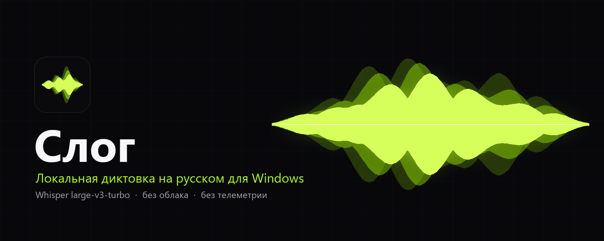

<div align="center">
  
  <p>
    <a href="https://github.com/egoist-ai1/Slog/releases/latest"><strong>Скачать установщик</strong></a> ·
    <a href="CHANGELOG.md">История изменений</a> ·
    <a href="docs/DESIGN.md">Дизайн-система</a> ·
    Windows 10/11 x64 · <a href="LICENSE">MIT</a>
  </p>
</div>

**Слог** записывает речь по удержанию кнопки, распознаёт её на вашем компьютере и вставляет готовый текст в активное поле: в редактор, терминал, мессенджер, браузер. Звук и текст не уходят в сеть, аккаунта и телеметрии нет.

## Что внутри

- **Whisper large-v3-turbo (q5_0)** с русским языком, на видеокарте через Vulkan (без CUDA Toolkit). Пунктуация и английские названия (GitHub, Docker, Claude Code) ставятся сразу.
- **Модель живёт в памяти только пока вы диктуете.** Через минуту простоя она выгружается: в простое около 220 МБ памяти и 38 МБ видеопамяти. Новая запись загружает модель за секунду, пока вы говорите.
- **Капсула со спектром голоса**: 44 тонких столбика с падающими пиками и тонким контуром, чёрная капсула, один акцент (лайм). Анимации отключаются настройкой Windows «уменьшить движение».
- **Кнопка мыши** (по умолчанию Mouse 5) принадлежит Слогу и не доходит до других программ. В играх она проходит как обычно.
- **Автозапуск и микрофон**: «Запускать вместе с Windows» включается в настройках; микрофон подключается сам, когда появляется устройство, возобновлять вручную не нужно.
- **Словарь** названий и терминов с защитой от ложных замен, голосовые команды («запятая», «новая строка»), нормализация чисел.
- **Защита от выдуманного текста**: Whisper на шуме придумывает фразы, поэтому тишина отсекается перед распознаванием, а известные «галлюцинации» и зацикливания фильтруются на выходе.

## Установка

1. Скачайте `Slog-Setup-3.1.0-win-x64.exe` из [релиза](https://github.com/egoist-ai1/Slog/releases/latest) (около 585 МБ: приложение, .NET и модель внутри).
2. Запустите установщик. Он не требует прав администратора и обновляет предыдущую установку, сохраняя настройки.
3. Поставьте курсор в поле ввода, удерживайте **Mouse 5** (или **Ctrl + Alt + Space**), говорите, отпустите.

Установщик не подписан сертификатом, поэтому Windows SmartScreen может показать предупреждение.

## Требования

| | |
|---|---|
| ОС | Windows 10 (1903) или 11, x64 |
| Видеокарта | любая с драйвером Vulkan (NVIDIA, AMD, Intel). Без неё работает на процессоре, но заметно медленнее |
| Память | 1–2 ГБ свободных (ОЗУ и видеопамять) на время диктовки |
| Диск | около 1 ГБ |

## Измерения

Измерено на 110 записях автора (чистая речь, быстрая речь, числа, команды, русский с английскими названиями), RTX 5070 Ti. Это один голос и один микрофон, поэтому цифры показывают порядок, а не гарантию.

| Доля ошибок в словах | Прежний движок (GigaAM v3) | Слог (Whisper turbo) |
|---|---:|---:|
| Русский с английскими названиями | 18,2% | 11,9% |
| Чистая русская речь | 3,2% | 2,2% |
| Быстрая речь | 7,8% | 5,9% |
| Английские слова найдены | 65 из 121 | 91 из 121 |
| Задержка распознавания (медиана) | около 90 мс | около 200 мс |

Словарь настраивался по тем же записям, поэтому выигрыш на новых фразах может быть меньше. Ошибки остаются: Whisper иногда подставляет близкое по звучанию слово. Честная оценка на вашем голосе: соберите свои записи инструментом `--corpus-record` и сравните (см. [tests/corpus](tests/corpus/README.md)).

## Сборка из исходников

```powershell
dotnet build .\Egoist.Voice.sln -c Release
dotnet test  .\Egoist.Voice.sln -c Release
# установщик: portable → installer (нужен Inno Setup из dotnet tool manifest)
pwsh .\scripts\Build-CompactPortable.ps1 -OutputDirectory .\artifacts\slog\portable
pwsh .\scripts\Build-CompactInstaller.ps1 -StagingDirectory .\artifacts\slog\portable -Build
```

Для portable-сборки нужен файл модели `ggml-large-v3-turbo-q5_0.bin` (574 041 195 байт, SHA-256 `3942217…ffa7e2`) в `artifacts/models-whisper/Models/Speech/whisper-large-v3-turbo-q5_0-v1/`. Скрипт проверяет хеш и ничего не скачивает.

## Приватность

Запись, распознавание и вставка идут локально. Журнал не содержит ни аудио, ни распознанного текста. История последних записей выключена по умолчанию.

## Лицензии

Код: [MIT](LICENSE). Модель Whisper (OpenAI) и whisper.cpp: MIT, [текст](docs/models/Whisper-LICENSE.txt). Остальное: [THIRD-PARTY-NOTICES.md](THIRD-PARTY-NOTICES.md).
